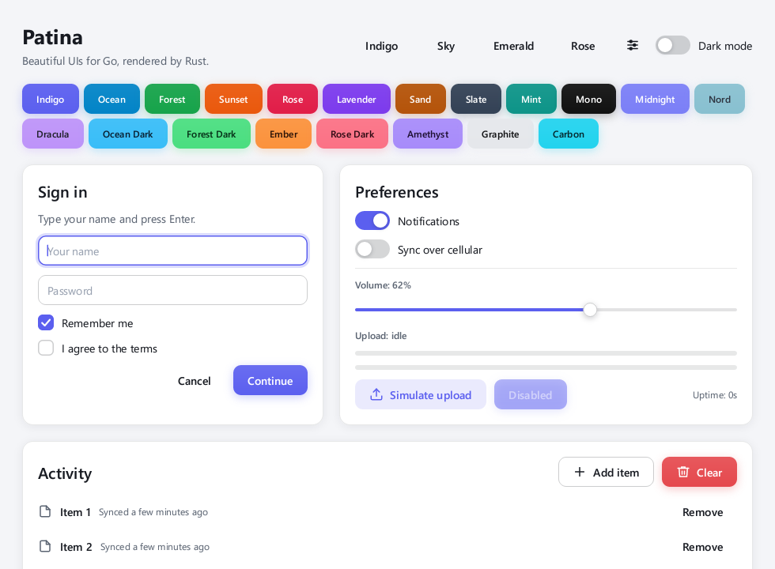
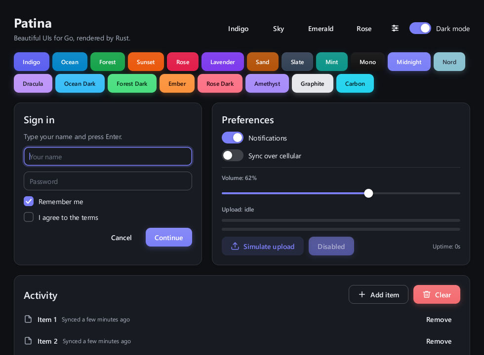
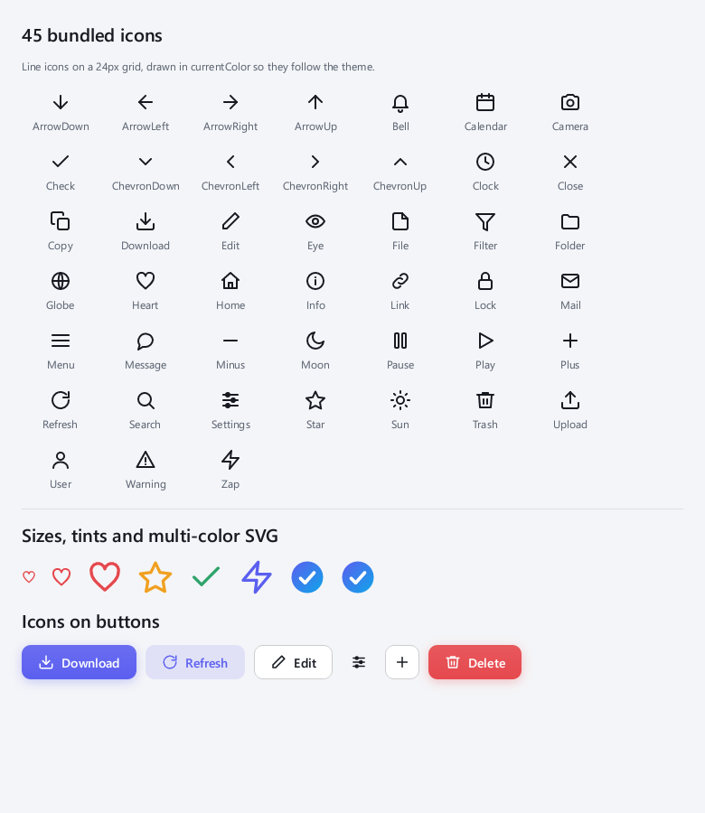
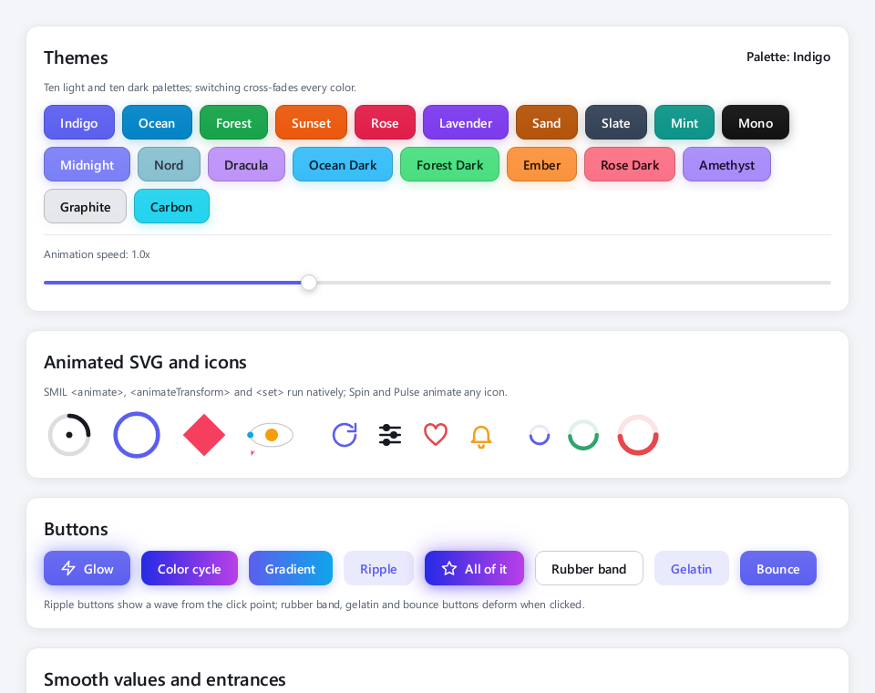
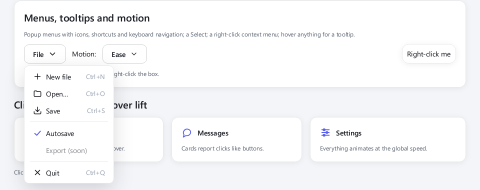

# Patina

**Beautiful desktop UIs for Go, rendered by Rust.**

Patina is a small, declarative UI toolkit for Go. Windows, flexbox layout, text and every pixel
are produced by `patina-core`, a Rust library that is loaded at runtime through a tiny C ABI.
No cgo, no C compiler, no web view: a plain `go build` gives you a single self-contained
executable with a modern look, smooth hover/press/focus animations, light and dark themes and
HiDPI-crisp rendering.

| Light | Dark |
| --- | --- |
|  |  |

```go
package main

import (
	"fmt"
	"log"

	"github.com/patina-ui/patina"
)

func main() {
	win := patina.NewWindow("Hello, Patina", 480, 320)

	count := 0
	value := patina.Title("0").Align(patina.TextCenter).Expand()

	win.SetContent(
		patina.Column(
			patina.Heading("Counter"),
			patina.Card(
				patina.Row(
					patina.Button("−").Tonal().OnClick(func() { count--; value.SetText(fmt.Sprint(count)) }),
					value,
					patina.Button("+").OnClick(func() { count++; value.SetText(fmt.Sprint(count)) }),
				).Gap(16),
			),
		).Padding(24).Gap(12),
	)

	if err := patina.Run(); err != nil {
		log.Fatal(err)
	}
}
```

## Toolchain

Verified on 6 September 2026 against the current releases:

| Tool | Latest release | Used here | Notes |
| --- | --- | --- | --- |
| Go | 1.27.2 | `go 1.26` in `go.mod` | Any Go ≥ 1.26 works; 1.27 needs no changes. |
| Rust | 1.98 | `rust-version = "1.85"` | Edition 2024. Built with 1.96.0. |
| purego | v0.11.0 | v0.11.0 | Loads the core without cgo. |
| winit / softbuffer | 0.30.13 / 0.4.8 | same | Windowing and presentation. |
| taffy / tiny-skia / fontdue | 0.14.0 / 0.12.0 / 0.9.4 | same | Layout, rasterization, fonts. |
| resvg | 0.48.1 | same | SVG rendering. |

Only 64-bit targets are supported (Windows, macOS, Linux).

## Building

Rust is only needed by whoever builds the core; Go programs consume a prebuilt shared library.

```bash
# 1. Build the Rust core and embed it into the Go package (needs cargo from https://rustup.rs)
go run ./tools/build

# 2. Run an example
go run ./examples/hello      # a counter
go run ./examples/showcase   # every widget, theming, timers, background work
go run ./examples/events     # prints every callback as you interact
go run ./examples/icons      # the bundled icon set, tints, multi-color SVG, icon buttons
```

`tools/build` runs `cargo build --release` and copies `patina_core.dll` / `libpatina_core.so` /
`libpatina_core.dylib` into `internal/native/lib/<goos>_<goarch>/`, where `//go:embed` picks it up.
At start-up the package extracts the embedded core to the user cache directory and loads it.

Without an embedded core the package also looks at `PATINA_LIBRARY`, next to the executable, and
in cargo's `target/` directories above the working directory, which is convenient during
development (`cargo build --release` at the repository root is enough).

Offscreen rendering does not need a display, so `go test ./...` and `cargo run --example snapshot`
work on CI machines (see `.github/workflows/ci.yml`).

## The API in five minutes

Everything is built from constructors that return typed widgets with chainable modifiers.
Modifiers return the concrete type, so you can keep a reference and update it later:

```go
status := patina.Caption("Ready").Color(patina.Success)
status.SetText("Saving…")
```

**Layout containers**

```go
patina.Column(children...)   // vertical stack, children stretch to the width
patina.Row(children...)      // horizontal, vertically centered
patina.Card(children...)     // Column on an elevated surface (padding, radius, border, shadow)
patina.Scroll(children...)   // vertical scrolling column with an overlay scrollbar
patina.Spacer()              // flexible space that pushes siblings apart
patina.Divider()             // hairline (horizontal in a Column, vertical in a Row)
```

Containers take `.Gap(px)`, `.Align(patina.AlignCenter)`, `.Justify(patina.SpaceBetween)`,
`.Wrap(true)`, and can be edited later with `.Add`, `.Insert`, `.Remove`, `.Clear`.

**Widgets**

```go
patina.Label("text")           patina.Title("…")  patina.Heading("…")  patina.Caption("…")
patina.Button("Save").OnClick(fn)              // .Primary() .Tonal() .Outlined() .Ghost() .Danger()
patina.TextInput("Email").OnChange(fn).OnSubmit(fn)   // .Password() .MaxLength(n) .Value() .SetValue()
patina.Checkbox("Remember me").OnChange(func(on bool){})
patina.Switch("Dark mode").SetOn(true)
patina.Slider(0, 100).Step(1).OnChange(func(v float64){})
patina.Progress(0.4)   /  patina.Progress(0).Indeterminate(true)
patina.Image(img).Fit(patina.Cover)
patina.Spinner().Color(patina.Accent)        // indeterminate activity indicator
patina.Select("Small", "Large").OnChange(func(i int, v string) {})   // dropdown
```

**Modifiers available on every widget**

```go
.Width(px) .Height(px) .WidthPercent(50) .MinWidth(px) .MaxHeight(px)
.Grow(1) / .Expand()  .Shrink(0)  .AlignSelf(patina.AlignEnd)
.Padding(16) .PaddingXY(16, 8) .PaddingEach(l, t, r, b)   .Margin(…)
.Background(patina.Surface) .Radius(12) .Border(1, patina.Outline) .Shadow(2) .Opacity(0.5)
.Visible(b) .Show() .Hide()   .Disabled(b) .Enable() .Disable()   .Focus()
.OnHover(enter, leave) .OnFocusChange(focus, blur)   .Destroy()
.Enter(patina.Pop) .Gradient(from, to) .Ripple(true) .PressEffect(patina.Gelatin)   // see Animation below
.Tooltip("…") .ContextMenu(menu) .Spring(stiffness, damping)
```

Text widgets add `.FontSize(px)`, `.Weight(patina.Semibold)`, `.Bold()`, `.Color(c)`, `.Mono()`.

**Vector graphics and icons**

SVG is rendered natively by the core (resvg), at the exact size and scale it is displayed at:

```go
import "github.com/patina-ui/patina/icons"

patina.Icon(icons.Search).Size(20, 20).Tint(patina.TextSecondary)   // monochrome, recolored
patina.SVG(logoSVG).Size(48, 48)                                     // keeps its own colors
patina.Button("Save").Icon(icons.Download)                           // icon before the caption
patina.Button("").Ghost().Icon(icons.Settings)                       // square icon button
win.SetIconSVG(logoSVG)                                              // title bar and taskbar
img, err := patina.RenderSVG(svg, 128, 128)                          // to an image.NRGBA
```

`currentColor` resolves to the theme's text color, so icons drawn in `currentColor` follow
light and dark mode on their own; `Tint` recolors any SVG using it as a mask. The `icons`
package bundles 45 line icons (search, check, arrows, trash, settings, ...). SVG `<text>`
elements are not rendered.



**Animation**

Everything that moves runs on one animation clock in the core, so a single call slows down or
switches off all of it:

```go
patina.SetAnimationSpeed(0.5)                            // slow motion; 2 = double speed
patina.ReducedMotion(true)                               // no motion: changes apply instantly

patina.SVG(loaderSVG)                                    // SMIL <animate>/<animateTransform>/<set> just play
patina.Icon(icons.Refresh).Spin(time.Second)             // rotate any icon
patina.Icon(icons.Heart).Pulse(900 * time.Millisecond)   // breathe
patina.Spinner().Size(32, 32).Color(patina.Success)      // activity indicator

patina.Button("Go").Glow(true)                           // pulsing halo
patina.Button("Party").ColorCycle(6 * time.Second)       // continuous hue rotation
patina.Button("Buy").Gradient(patina.Hex("#5B5FEF"), patina.Hex("#0EA5E9")).Ripple(true)
patina.Button("Jump").Gelatin()                          // press effects: .RubberBand() .Gelatin() .Bounce()
patina.SetMotion(patina.BouncyMotion)                    // sliders, toggles and entrances on springs (Ease/Spring/Bouncy)
progress.Spring(250, 12)                                 // or a custom spring for one widget

patina.Card(…).Lift().OnClick(func() {})                 // clickable card that lifts on hover
patina.Card(…).Enter(patina.Pop)                         // FadeIn, SlideUp/Down/Left/Right, Pop
progress.SetValue(0.8)                                   // sliders and progress bars ease into place
```

Supported SMIL: `<animate>`, `<animateTransform>` (rotate, scale, translate, skewX, skewY) and
`<set>` on any attribute, with `from`/`to`/`by`/`values`, `keyTimes`, `calcMode` (`linear`,
`discrete`, `paced`, `spline` + `keySplines`), `begin` (offsets), `dur`, `repeatCount`/`repeatDur`,
`fill="freeze"` and `additive="sum"`. `<animateMotion>` moves an element along a `path`, an `<mpath>` reference or a list of
`values`, with `keyPoints`/`keyTimes` and `rotate="auto"`. Event-based `begin` values are not
supported. Animated documents are rasterized per frame and cached on their loop period.



**Menus, tooltips and dropdowns**

```go
menu := patina.Menu(
    patina.MenuItem("New", newFile).Icon(icons.Plus).Shortcut("Ctrl+N"),
    patina.MenuSeparator(),
    patina.MenuItem("Autosave", toggleAutosave).Checked(true),
    patina.MenuItem("Export", nil).Disable(),
)
patina.Button("File").Menu(menu)                          // opens below the button
card.ContextMenu(menu)                                     // opens at the pointer on right click
menu.OpenAt(win, x, y)                                     // anywhere you like; menu.Close()
patina.Select("Small", "Medium", "Large").OnChange(func(i int, v string) {})
patina.Icon(icons.Info).Tooltip("Shown after the pointer rests here")
```

Menus pop in with an entrance animation, close on Escape, a click outside or after a choice,
and support Up/Down/Home/End with Enter or Space. Tooltips appear after half a second and
follow the widget they belong to.



**Colors and themes**

Colors are either literals (`patina.RGB(99, 102, 241)`, `patina.Hex("#6366F1")`) or theme
tokens (`patina.Accent`, `patina.Surface`, `patina.Text`, `patina.TextSecondary`,
`patina.Outline`, `patina.Danger`, …) that resolve against the active palette:

```go
patina.SetTheme(patina.Dark)       // or patina.Light, patina.System
patina.SetPalette("Nord")          // any of the 20 built-in palettes; every color cross-fades
patina.Palettes()                  // []PaletteInfo{Name, Dark, Accent, OnAccent}
patina.DefinePalette("Brand", false, patina.PaletteColors{Background: …, Accent: …})
patina.SetAccent(patina.Hex("#0EA5E9"))
patina.SetThemeTransition(0)       // switch instantly instead of the 280 ms cross-fade
patina.SetFont("/path/Inter-Regular.ttf", "/path/Inter-Bold.ttf", "")
```

Built-in light palettes: Indigo, Ocean, Forest, Sunset, Rose, Lavender, Sand, Slate, Mint, Mono.
Dark palettes: Midnight, Nord, Dracula, Ocean Dark, Forest Dark, Ember, Rose Dark, Amethyst,
Graphite, Carbon. Choosing a palette also switches the mode to match it.

**Windows**

```go
win := patina.NewWindow("Title", 900, 600).MinSize(480, 320)
win.SetContent(root)
win.OnCloseRequest(func() bool { return confirmDiscard() })   // return false to keep it open
win.OnResize(func(w, h int) {})
win.Snapshot("shot.png", 900, 600, 2)   // offscreen render at 2x, no event loop needed
```

**Threads, timers and background work**

`patina.Run()` must be called from the main goroutine (the package locks it to the main OS
thread). Every callback runs on that thread. Widget setters are safe to call from any goroutine;
to run arbitrary code on the UI thread use:

```go
patina.Post(func() { label.SetText("done") })   // as soon as possible
patina.After(2*time.Second, func() { … })
ticker := patina.Every(time.Second, func() { … }); ticker.Stop()
```

## How it works

```
Go program ──▶ patina (Go API, widget tree, callbacks)
                 │  purego: integer-only C ABI, no cgo
                 ▼
            patina-core (Rust, cdylib)
              ├─ winit      windows, input, DPI, event loop
              ├─ taffy      flexbox layout
              ├─ fontdue    system font loading and glyph rasterization
              ├─ tiny-skia  anti-aliased vector rendering, gradients, clipping
              ├─ resvg      SVG parsing and rasterization
              └─ softbuffer presenting the frame to the window
```

* **Retained tree.** The Go side creates nodes and sets properties (`patina_set_i64/f64/str`);
  the core owns layout, painting, animation and hit testing.
* **Events flow back** through a single callback (`patina_set_event_handler`) as
  `(node, event, a, b, text)`. The core never holds its state lock while calling back, so event
  handlers can freely call the API.
* **Floats cross the ABI as bit patterns** (`math.Float64bits`) so the binding works with
  purego's `SyscallN` on every platform, including Windows where purego has no `Dlopen`.
* **Animations** are exponential tweens driven by the event loop at ~60 fps only while
  something is moving; otherwise the loop sleeps.
* **Fonts** come from the OS (Segoe UI, Helvetica, DejaVu/Noto/Liberation) unless you call
  `SetFont` or set `PATINA_FONT`.

The full C ABI is documented in [`core/include/patina.h`](core/include/patina.h) and can be used
from any language, not just Go.

## Repository layout

```
core/                 Rust crate patina-core (cdylib + rlib)
  src/ffi.rs          the C ABI
  src/app.rs          winit event loop, frame pacing, presentation
  src/layout.rs       taffy integration
  src/render.rs       widget painting
  src/smil.rs         SVG SMIL animation (animate, animateTransform, set)
  src/palettes.rs     the 20 built-in palettes
  src/input.rs        pointer and keyboard handling
  src/text.rs         fonts, glyph cache, word wrapping
  src/paint.rs        rounded rects, shadows, gradients, clipping
  examples/snapshot.rs  offscreen showcase render (cargo run --example snapshot)
internal/native/      purego bindings + embedded core loader
*.go                  the public Go API
examples/             hello, showcase
tools/build/          builds the core and embeds it
hollowbloom/          a cozy action RPG built on the same Rust stack (see below)
```

## Useful environment variables

| Variable | Effect |
| --- | --- |
| `PATINA_LIBRARY` | Path to the core shared library to load instead of the embedded one. |
| `PATINA_FONT`, `PATINA_FONT_BOLD`, `PATINA_FONT_SEMIBOLD`, `PATINA_FONT_MONO` | Font files to use. |
| `PATINA_AUTO_QUIT_MS` | Quit the event loop after N milliseconds (smoke tests). |

## Roadmap

* Clipboard support and text selection by double click.
* Dialogs, tabs, tables, submenus.
* Shaping and font fallback (emoji, CJK, RTL) via cosmic-text.
* GPU presentation (wgpu) for very large windows.

## Also in this repository: Hollowbloom

[`hollowbloom/`](hollowbloom/README.md) is a cozy top-down action RPG written in Rust on the
same winit + softbuffer stack as the core: farm on the surface, delve an endless procedurally
generated dungeon below it, full of loot: 123 pieces of gear with random stats and rarities,
enchanting scrolls, copper, silver and gold coins, and 38 crops to grow. A bus runs to
Bramblewick, a town of nineteen villagers with shops you can walk into, friendships and 111
quests. It is drawn in low-poly
3D with pixel-art textures by a software renderer that only ever outputs the 32 colours of the
Resurrect 32 palette, and it builds for Windows and Linux from a single machine.

```bash
cargo run -p hollowbloom --release
```


## License

MIT. See [LICENSE](LICENSE).
